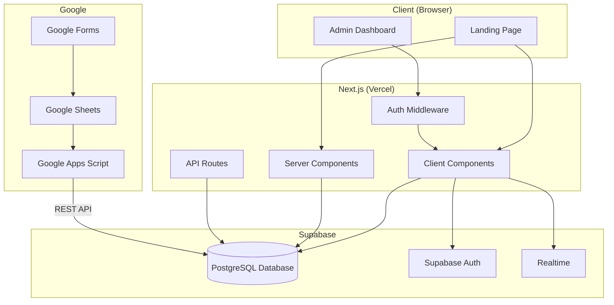
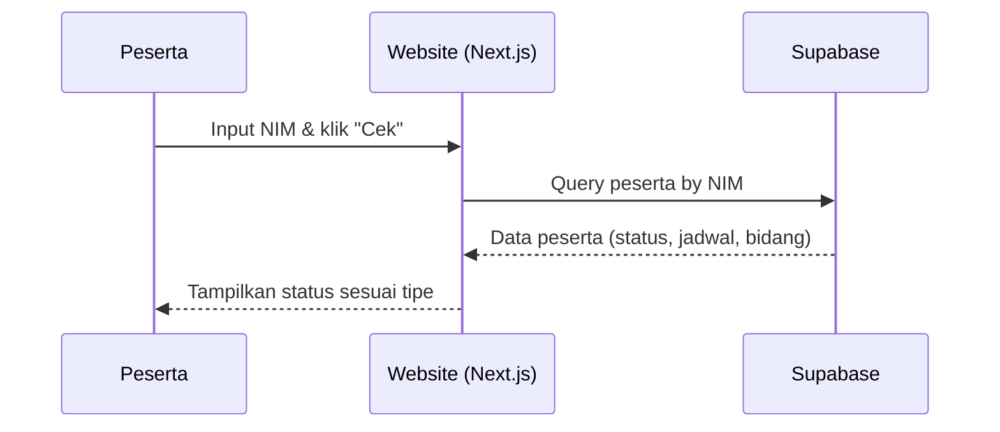
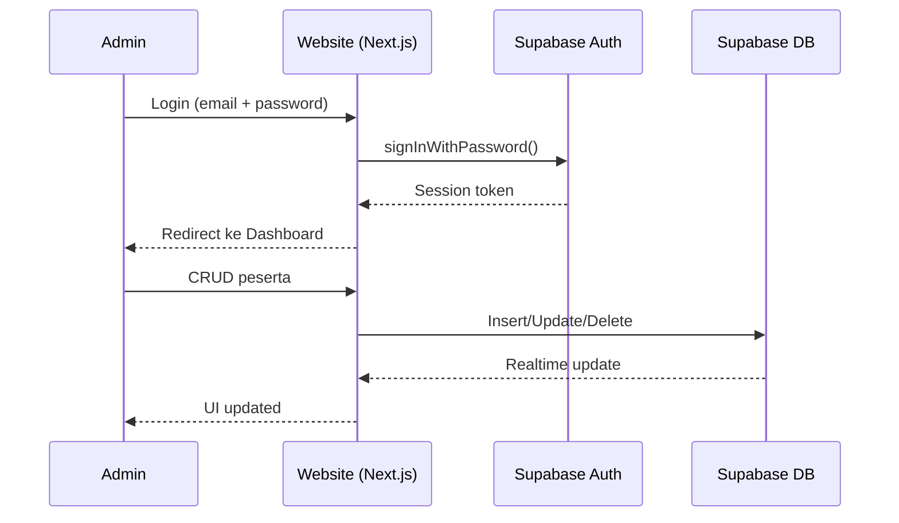
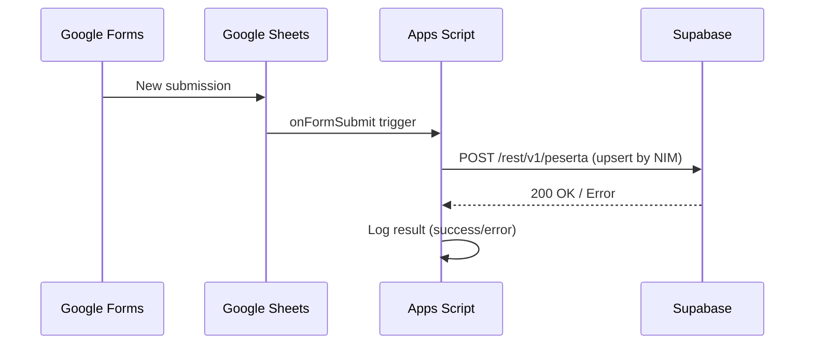
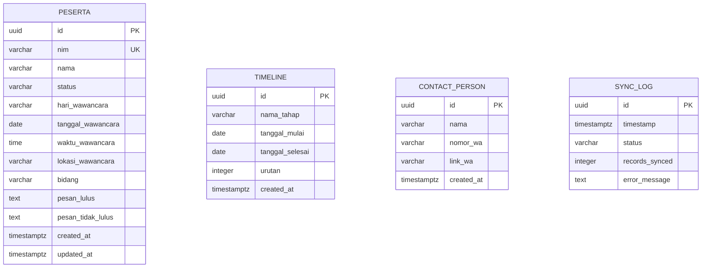

# Design Document: HMPS Recruitment Info

## Overview

Website informasi Open Recruitment HMPS Informatika berupa landing page publik dengan dashboard admin. Sistem ini memungkinkan peserta mengecek status pendaftaran via NIM, melihat timeline seleksi, dan menghubungi panitia. Admin mengelola data peserta melalui dashboard yang dilindungi Supabase Auth. Data disinkronisasi otomatis dari Google Sheets ke Supabase.

### Tech Stack

| Layer | Technology | Rationale |
|-------|-----------|-----------|
| Framework | Next.js 14 (App Router) | Full-stack React framework dengan SSR/SSG, API routes, dan routing bawaan |
| Language | TypeScript | Type safety untuk mengurangi bug runtime |
| Styling | Tailwind CSS | Utility-first CSS untuk desain responsif yang cepat dan konsisten |
| Database | Supabase (PostgreSQL) | BaaS dengan realtime subscriptions, auth, dan REST API |
| Auth | Supabase Auth | Email/password authentication terintegrasi dengan database |
| Sync | Google Apps Script + Supabase REST API | Trigger-based sync dari Google Sheets ke Supabase |
| Deployment | Vercel | Zero-config deployment untuk Next.js |
| State Management | React hooks + Supabase Realtime | Minimal state management, data langsung dari Supabase |

### Key Design Decisions

1. **Next.js App Router** — Memungkinkan server components untuk landing page (SEO-friendly) dan client components untuk interaktivitas (cek status, dashboard).
2. **Single-page landing + separate admin route** — Landing page sebagai satu halaman scroll, dashboard admin di route `/admin` yang dilindungi middleware auth.
3. **Google Apps Script untuk sync** — Lebih sederhana daripada webhook server terpisah. Script berjalan di Google Cloud, trigger otomatis saat form submit.
4. **Supabase Realtime** — Dashboard admin mendapat update data tanpa refresh manual.

## Architecture

### System Architecture Diagram



### Request Flow





### Sync Flow



## Components and Interfaces

### Page Structure

```
/                     → Landing Page (public)
/admin/login          → Login Page (public)
/admin                → Dashboard Admin (protected)
```

### Component Tree

```
App
├── LandingPage
│   ├── Navbar (links + Login button)
│   ├── HeroSection (judul + deskripsi oprec)
│   ├── DepartemenSection
│   │   └── DepartemenCard × 7
│   ├── TimelineSection
│   │   └── TimelineItem × N
│   ├── CekStatusSection
│   │   ├── NimInputForm
│   │   └── StatusResult
│   │       ├── StatusWawancara
│   │       ├── StatusLulus
│   │       └── StatusTidakLulus
│   └── ContactSection
│       └── ContactCard × N
├── AdminLogin
│   └── LoginForm
└── AdminDashboard (protected)
    ├── AdminNavbar (logout button + sync indicator)
    ├── PesertaTable (shows jadwal columns: hari, tanggal, jam, lokasi for status "wawancara")
    ├── AddPesertaModal
    ├── EditPesertaModal
    └── EditJadwalModal (edit jadwal wawancara without changing status)
```

### Key Interfaces (TypeScript)

```typescript
// types/peserta.ts
export type StatusPeserta = 'wawancara' | 'lulus' | 'tidak_lulus';

export interface Peserta {
  id: string;                    // UUID, primary key
  nim: string;                   // Unique, indexed
  nama: string;
  status: StatusPeserta;
  // Fields untuk status wawancara (Jadwal_Wawancara)
  hari_wawancara?: string;       // Nama hari, e.g. "Senin", "Selasa"
  tanggal_wawancara?: string;    // ISO date string, e.g. "2025-07-15"
  waktu_wawancara?: string;      // HH:mm format, e.g. "10:00"
  lokasi_wawancara?: string;     // e.g. "Ruang Rapat Lt.3"
  // Fields untuk status lulus
  bidang?: string;               // Nama departemen penempatan
  pesan_lulus?: string;          // Pesan ucapan khusus
  // Fields untuk status tidak lulus
  pesan_tidak_lulus?: string;    // Pesan motivasi
  // Metadata
  created_at: string;
  updated_at: string;
}

// types/timeline.ts
export interface TimelineItem {
  id: string;
  nama_tahap: string;
  tanggal_mulai: string;
  tanggal_selesai: string;
  is_active: boolean;
}

// types/departemen.ts
export interface Departemen {
  id: string;
  nama: string;
  deskripsi: string;
  icon?: string;
}

// types/contact.ts
export interface ContactPerson {
  id: string;
  nama: string;
  nomor_wa: string;
  link_wa: string;
}

// types/sync.ts
export interface SyncLog {
  id: string;
  timestamp: string;
  status: 'success' | 'error';
  records_synced: number;
  error_message?: string;
}
```

### Supabase Client Interface

```typescript
// lib/supabase.ts
import { createClient } from '@supabase/supabase-js';

// Client-side (browser)
export const supabase = createClient(
  process.env.NEXT_PUBLIC_SUPABASE_URL!,
  process.env.NEXT_PUBLIC_SUPABASE_ANON_KEY!
);

// Server-side (API routes, server components)
export const supabaseAdmin = createClient(
  process.env.NEXT_PUBLIC_SUPABASE_URL!,
  process.env.SUPABASE_SERVICE_ROLE_KEY!
);
```

### Core Functions

```typescript
// lib/peserta.ts
export async function getPesertaByNim(nim: string): Promise<Peserta | null>;
export async function getAllPeserta(): Promise<Peserta[]>;
export async function createPeserta(data: Omit<Peserta, 'id' | 'created_at' | 'updated_at'>): Promise<Peserta>;
export async function updatePeserta(id: string, data: Partial<Peserta>): Promise<Peserta>;
export async function deletePeserta(id: string): Promise<void>;

// lib/auth.ts
export async function signIn(email: string, password: string): Promise<Session>;
export async function signOut(): Promise<void>;
export async function getSession(): Promise<Session | null>;
```

## Data Models

### Database Schema (Supabase/PostgreSQL)

```sql
-- Tabel utama peserta
CREATE TABLE peserta (
  id UUID DEFAULT gen_random_uuid() PRIMARY KEY,
  nim VARCHAR(20) UNIQUE NOT NULL,
  nama VARCHAR(255) NOT NULL,
  status VARCHAR(20) NOT NULL CHECK (status IN ('wawancara', 'lulus', 'tidak_lulus')),
  hari_wawancara VARCHAR(10),
  tanggal_wawancara DATE,
  waktu_wawancara TIME,
  lokasi_wawancara VARCHAR(255),
  bidang VARCHAR(100),
  pesan_lulus TEXT,
  pesan_tidak_lulus TEXT,
  created_at TIMESTAMPTZ DEFAULT NOW(),
  updated_at TIMESTAMPTZ DEFAULT NOW()
);

-- Index untuk pencarian NIM
CREATE INDEX idx_peserta_nim ON peserta(nim);

-- Tabel timeline
CREATE TABLE timeline (
  id UUID DEFAULT gen_random_uuid() PRIMARY KEY,
  nama_tahap VARCHAR(255) NOT NULL,
  tanggal_mulai DATE NOT NULL,
  tanggal_selesai DATE NOT NULL,
  urutan INTEGER NOT NULL,
  created_at TIMESTAMPTZ DEFAULT NOW()
);

-- Tabel contact person
CREATE TABLE contact_person (
  id UUID DEFAULT gen_random_uuid() PRIMARY KEY,
  nama VARCHAR(255) NOT NULL,
  nomor_wa VARCHAR(20) NOT NULL,
  link_wa VARCHAR(500) NOT NULL,
  created_at TIMESTAMPTZ DEFAULT NOW()
);

-- Tabel sync log
CREATE TABLE sync_log (
  id UUID DEFAULT gen_random_uuid() PRIMARY KEY,
  timestamp TIMESTAMPTZ DEFAULT NOW(),
  status VARCHAR(10) NOT NULL CHECK (status IN ('success', 'error')),
  records_synced INTEGER DEFAULT 0,
  error_message TEXT
);

-- Trigger untuk auto-update updated_at
CREATE OR REPLACE FUNCTION update_updated_at()
RETURNS TRIGGER AS $$
BEGIN
  NEW.updated_at = NOW();
  RETURN NEW;
END;
$$ LANGUAGE plpgsql;

CREATE TRIGGER peserta_updated_at
  BEFORE UPDATE ON peserta
  FOR EACH ROW
  EXECUTE FUNCTION update_updated_at();

-- Row Level Security
ALTER TABLE peserta ENABLE ROW LEVEL SECURITY;

-- Public read access (untuk cek status)
CREATE POLICY "Public can read peserta" ON peserta
  FOR SELECT USING (true);

-- Admin full access
CREATE POLICY "Admin full access" ON peserta
  FOR ALL USING (auth.role() = 'authenticated');

ALTER TABLE timeline ENABLE ROW LEVEL SECURITY;
CREATE POLICY "Public can read timeline" ON timeline
  FOR SELECT USING (true);
CREATE POLICY "Admin manage timeline" ON timeline
  FOR ALL USING (auth.role() = 'authenticated');

ALTER TABLE contact_person ENABLE ROW LEVEL SECURITY;
CREATE POLICY "Public can read contacts" ON contact_person
  FOR SELECT USING (true);
CREATE POLICY "Admin manage contacts" ON contact_person
  FOR ALL USING (auth.role() = 'authenticated');

ALTER TABLE sync_log ENABLE ROW LEVEL SECURITY;
CREATE POLICY "Admin read sync_log" ON sync_log
  FOR SELECT USING (auth.role() = 'authenticated');
CREATE POLICY "Service insert sync_log" ON sync_log
  FOR INSERT WITH CHECK (true);
```

### Google Apps Script (Sync)

```javascript
// Google Apps Script - Code.gs
function onFormSubmit(e) {
  const sheet = SpreadsheetApp.getActiveSpreadsheet().getActiveSheet();
  const lastRow = sheet.getLastRow();
  const data = sheet.getRange(lastRow, 1, 1, sheet.getLastColumn()).getValues()[0];
  
  const peserta = {
    nim: data[1],        // Kolom B: NIM
    nama: data[2],       // Kolom C: Nama
    status: 'wawancara'  // Default status saat baru mendaftar
  };

  const response = UrlFetchApp.fetch(SUPABASE_URL + '/rest/v1/peserta', {
    method: 'POST',
    headers: {
      'apikey': SUPABASE_ANON_KEY,
      'Authorization': 'Bearer ' + SUPABASE_SERVICE_KEY,
      'Content-Type': 'application/json',
      'Prefer': 'resolution=merge-duplicates'
    },
    payload: JSON.stringify(peserta),
    muteHttpExceptions: true
  });

  // Log sync result
  logSync(response.getResponseCode() === 201 ? 'success' : 'error', response);
}
```

### Entity Relationship Diagram



## Correctness Properties

*A property is a characteristic or behavior that should hold true across all valid executions of a system — essentially, a formal statement about what the system should do. Properties serve as the bridge between human-readable specifications and machine-verifiable correctness guarantees.*

### Property 1: Timeline rendering preserves order and required fields

*For any* list of TimelineItem objects, the rendering function SHALL output them sorted by `urutan` field, and each rendered item SHALL contain `nama_tahap`, `tanggal_mulai`, and `tanggal_selesai`.

**Validates: Requirements 2.1, 2.2**

### Property 2: Active timeline detection based on current date

*For any* date and set of TimelineItem objects, a timeline item SHALL be marked as active if and only if the given date falls within the range `[tanggal_mulai, tanggal_selesai]` (inclusive).

**Validates: Requirements 2.3**

### Property 3: Status display shows correct fields based on status type

*For any* Peserta object, the status display function SHALL:
- If `status === 'wawancara'`: include `nama`, `hari_wawancara`, `tanggal_wawancara`, `waktu_wawancara`, and `lokasi_wawancara`
- If `status === 'lulus'`: include `pesan_lulus`, `nama`, and `bidang`
- If `status === 'tidak_lulus'`: include `pesan_tidak_lulus`

**Validates: Requirements 3.3, 3.4, 3.5**

### Property 4: Contact person rendering includes nama and valid clickable link

*For any* ContactPerson object with a valid `nomor_wa`, the rendered output SHALL contain the `nama` and a clickable link in the format `https://wa.me/{normalized_number}`.

**Validates: Requirements 4.2, 4.3**

### Property 5: Peserta CRUD round-trip (create then read)

*For any* valid Peserta data (with unique NIM), creating the peserta and then querying by NIM SHALL return a record with the same `nim`, `nama`, and `status` values.

**Validates: Requirements 3.2, 5.3**

### Property 6: Peserta update reflects all changes

*For any* existing Peserta and any valid partial update (including status changes), applying the update and then reading the record SHALL reflect all updated fields while preserving unchanged fields.

**Validates: Requirements 5.4, 5.6**

### Property 7: Peserta deletion removes from lookup

*For any* existing Peserta, after deletion, querying by that peserta's NIM SHALL return null/empty result.

**Validates: Requirements 5.5**

### Property 8: Unauthenticated access to protected routes redirects to login

*For any* request to a protected route (e.g., `/admin`) without a valid authentication session, the system SHALL respond with a redirect to the login page.

**Validates: Requirements 6.6**

### Property 9: Department card rendering includes nama and deskripsi

*For any* Departemen object, the rendered card component SHALL contain both the `nama` and `deskripsi` text.

**Validates: Requirements 8.9**

### Property 10: Google Sheets to Peserta mapping produces valid data

*For any* valid Google Sheets row containing NIM and nama columns, the mapping function SHALL produce a Peserta object with correct `nim`, `nama`, and default `status` of `'wawancara'`.

**Validates: Requirements 9.3**

### Property 11: Sync deduplication ensures one record per NIM

*For any* NIM value, syncing the same NIM multiple times SHALL result in exactly one record in the database for that NIM (idempotence).

**Validates: Requirements 9.5**

### Property 12: Jadwal wawancara validation requires all four fields

*For any* Peserta data with `status === 'wawancara'`, the validation function SHALL reject the data if any of the four jadwal fields (`hari_wawancara`, `tanggal_wawancara`, `waktu_wawancara`, `lokasi_wawancara`) is missing or empty.

**Validates: Requirements 5.7, 5.8**

### Property 13: Editing jadwal wawancara preserves status

*For any* existing Peserta with `status === 'wawancara'`, updating any combination of jadwal fields (`hari_wawancara`, `tanggal_wawancara`, `waktu_wawancara`, `lokasi_wawancara`) SHALL preserve the peserta's `status` as `'wawancara'` and not alter non-jadwal fields.

**Validates: Requirements 5.9**

## Error Handling

### Client-Side Errors

| Scenario | Handling |
|----------|----------|
| NIM tidak ditemukan | Tampilkan pesan "NIM tidak ditemukan. Pastikan NIM yang Anda masukkan sudah benar." |
| NIM kosong saat submit | Tampilkan validasi "NIM wajib diisi" (client-side validation) |
| Login gagal (kredensial salah) | Tampilkan pesan "Email atau password salah" |
| Network error saat cek status | Tampilkan pesan "Terjadi kesalahan jaringan. Silakan coba lagi." |
| Network error saat CRUD admin | Tampilkan toast notification dengan pesan error |
| Session expired | Redirect ke halaman login dengan pesan "Sesi Anda telah berakhir" |

### Server-Side / Sync Errors

| Scenario | Handling |
|----------|----------|
| Supabase connection failure | Return 500 dengan pesan generic, log detail error |
| Google Sheets sync failure | Catat di `sync_log` tabel dengan `status='error'` dan `error_message` |
| Duplicate NIM saat sync | Gunakan upsert (`resolution=merge-duplicates`) untuk menghindari error |
| Invalid data dari Google Sheets | Skip row, catat di error log, lanjutkan sync row lainnya |
| RLS policy violation | Return 403, tampilkan pesan "Akses ditolak" |

### Validation Rules

```typescript
// lib/validation.ts
export function validateNim(nim: string): { valid: boolean; error?: string } {
  if (!nim || nim.trim() === '') {
    return { valid: false, error: 'NIM wajib diisi' };
  }
  // NIM format: angka, panjang 8-15 karakter
  if (!/^\d{8,15}$/.test(nim.trim())) {
    return { valid: false, error: 'Format NIM tidak valid' };
  }
  return { valid: true };
}

export function validatePeserta(data: Partial<Peserta>): { valid: boolean; errors: string[] } {
  const errors: string[] = [];
  if (!data.nim) errors.push('NIM wajib diisi');
  if (!data.nama) errors.push('Nama wajib diisi');
  if (!data.status) errors.push('Status wajib dipilih');
  if (data.status === 'wawancara') {
    if (!data.hari_wawancara) errors.push('Hari wawancara wajib diisi');
    if (!data.tanggal_wawancara) errors.push('Tanggal wawancara wajib diisi');
    if (!data.waktu_wawancara) errors.push('Waktu wawancara wajib diisi');
    if (!data.lokasi_wawancara) errors.push('Lokasi wawancara wajib diisi');
  }
  if (data.status === 'lulus') {
    if (!data.bidang) errors.push('Bidang penempatan wajib diisi');
  }
  return { valid: errors.length === 0, errors };
}
```

## Testing Strategy

### Testing Framework

| Tool | Purpose |
|------|---------|
| Vitest | Unit tests & property-based tests |
| fast-check | Property-based testing library |
| React Testing Library | Component rendering tests |
| Playwright | E2E / integration tests |

### Test Categories

#### 1. Property-Based Tests (fast-check + Vitest)

Setiap correctness property di atas diimplementasikan sebagai property-based test dengan minimum **100 iterasi**.

```typescript
// Contoh: Property 3 - Status display
// Feature: hmps-recruitment-info, Property 3: Status display shows correct fields based on status type
import { fc } from '@fast-check/vitest';

fc.test(
  'status display shows correct fields for any peserta',
  pesertaArbitrary,
  (peserta) => {
    const result = renderStatusDisplay(peserta);
    if (peserta.status === 'wawancara') {
      expect(result).toContain(peserta.nama);
      expect(result).toContain(peserta.hari_wawancara);
      expect(result).toContain(peserta.tanggal_wawancara);
      expect(result).toContain(peserta.waktu_wawancara);
      expect(result).toContain(peserta.lokasi_wawancara);
    }
    // ... etc
  }
);
```

**Property test tag format:** `Feature: hmps-recruitment-info, Property {number}: {property_text}`

**Configuration:** Minimum 100 iterations per property test.

#### 2. Unit Tests (Vitest + React Testing Library)

- Rendering 7 department cards dengan konten spesifik (Req 8.2-8.8)
- Navbar contains correct links (Req 1.3)
- Login form renders correctly (Req 6.2)
- Error messages display correctly (Req 3.6, 3.7, 6.4)
- Specific timeline stages exist (Req 2.4)

#### 3. Integration Tests (Playwright)

- Full login flow: email/password → dashboard access
- CRUD operations via dashboard UI → verify in Supabase
- Realtime updates: insert via API → dashboard reflects change
- Auth guard: access /admin without login → redirect to login
- Google Sheets sync: add row → verify in Supabase (manual/CI)

#### 4. Visual / Responsive Tests

- Responsive layout at breakpoints: 320px, 768px, 1024px, 1440px
- Department cards: grid on desktop, stack on mobile
- Timeline visual indicator for active stage

### Test File Structure

```
__tests__/
├── unit/
│   ├── components/
│   │   ├── DepartemenCard.test.tsx
│   │   ├── TimelineSection.test.tsx
│   │   ├── CekStatusSection.test.tsx
│   │   ├── ContactSection.test.tsx
│   │   └── Navbar.test.tsx
│   ├── lib/
│   │   ├── validation.test.ts
│   │   ├── peserta.test.ts
│   │   └── sync-mapping.test.ts
│   └── properties/
│       ├── timeline.property.test.ts
│       ├── status-display.property.test.ts
│       ├── contact-render.property.test.ts
│       ├── peserta-crud.property.test.ts
│       ├── auth-guard.property.test.ts
│       ├── departemen-card.property.test.ts
│       ├── sync-dedup.property.test.ts
│       ├── jadwal-validation.property.test.ts
│       └── jadwal-edit.property.test.ts
├── integration/
│   ├── auth-flow.test.ts
│   ├── crud-operations.test.ts
│   └── realtime-updates.test.ts
└── e2e/
    ├── landing-page.spec.ts
    ├── cek-status.spec.ts
    └── admin-dashboard.spec.ts
```

